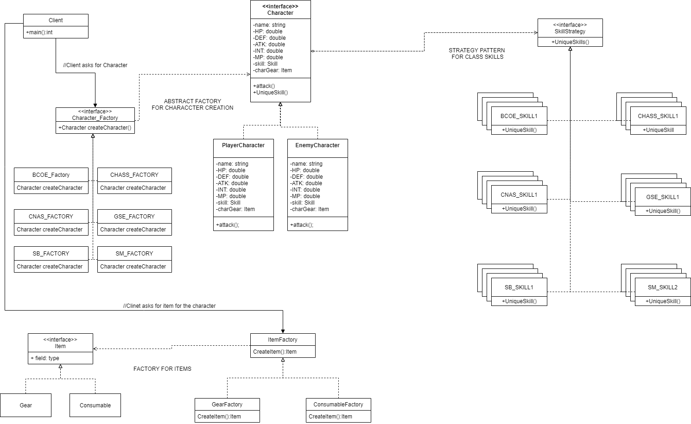

# UCRPG

 > Authors: [Dylan Fragante](https://github.com/sandy2304),
            [David Tellez](https://github.com/Davtellez01),
            [Alexander Trejo](https://github.com/trejotrejotrejo)
 
 ## Project Description
 * This is an RPG based on UCR campus and its different departments.
 * We think that this project would be fun and engaging to do. 
 ### Languages/tools/technologies
 * [C++] - to code the game.
 * [Image to ASCII converter](https://manytools.org/hacker-tools/convert-images-to-ascii-art/) - converts images into ASCII characters to implement into the code.
 ### Input/Output
 * Input: Different keys to interact with the game. Keyboard strings.
 * Output: Text from player's input. ASCII pictures based on different events.
 ### Design Patterns 
 #### Abstract Factory 
 * The abstract factory pattern will help with the creation of multiple entities that share the same traits but are specifically different to one another. This can be used to create different multiple types of enemies, areas, or classes. The different departments could have their own parent classes and we can make sub classes of that parent class to create multiple types of the same enemy, but with different statistics. This design pattern will solve the problem of creation of many classes with the same traits.
#### Strategy
* The strategy pattern will be useful with the creation of different attacks for the player and enemies. For example, we can create a context of attacks, and have different strategies of attacks like, slash, poison, fireball. Another context would be skills, and the different strategies with could be how player's or enemy's stats like attack power, defense, or skill points are affected. This strategy pattern will help reduce the burden of modifying a main class whenever we want to add another type of attack or skill. Instead of modifying a main class, we can just add more classes that have a common interface whenever we would want to add skills/attacks.

## Class Diagram

### Class Description
* There are three main parts to our class diagram:Abstract Factory pattern for the character creation and item, and strategy pattern for the character skills.
#### Character Creation:Abstract Factory
* This part is responsible for creating the character for the player, and enemy characters.
* The Character_Factory is making objects from the Character interface. The Character_Factory has different factories for the different classes.
#### Items: Abstract Factory
* The ItemFactory creates Item objects that the where the clinet can ask objects to give to any character classes
#### Skills: Strategy Pattern
* The SkillStrategy provides an interface to different skills that is given to characters when they are created by the Character_Factory. 
* Its context is the Character interface.
 > ## Phase III
 > You will need to schedule a check-in with the TA (during lab hours or office hours). Your entire team must be present. 
 > * Before the meeting you should perform a sprint plan like you did in Phase II
 > * In the meeting with your TA you will discuss: 
 >   - How effective your last sprint was (each member should talk about what they did)
 >   - Any tasks that did not get completed last sprint, and how you took them into consideration for this sprint
 >   - Any bugs you've identified and created issues for during the sprint. Do you plan on fixing them in the next sprint or are they lower priority?
 >   - What tasks you are planning for this next sprint.

 > ## Final deliverable
 > All group members will give a demo to the TA during lab time. The TA will check the demo and the project GitHub repository and ask a few questions to all the team members. 
 > Before the demo, you should do the following:
 > * Complete the sections below (i.e. Screenshots, Installation/Usage, Testing)
 > * Plan one more sprint (that you will not necessarily complete before the end of the quarter). Your In-progress and In-testing columns should be empty (you are not doing more work currently) but your TODO column should have a full sprint plan in it as you have done before. This should include any known bugs (there should be some) or new features you would like to add. These should appear as issues/cards on your Kanban board. 
 
 ## Screenshots
 > Screenshots of the input/output after running your application
 ## Installation/Usage
 > Instructions on installing and running your application
 ## Testing
 > How was your project tested/validated? If you used CI, you should have a "build passing" badge in this README.
 
