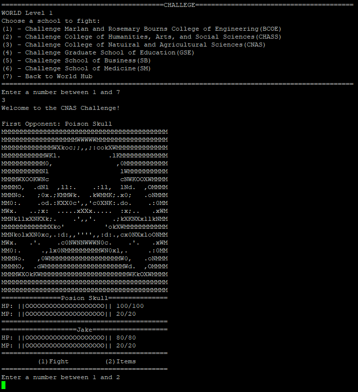
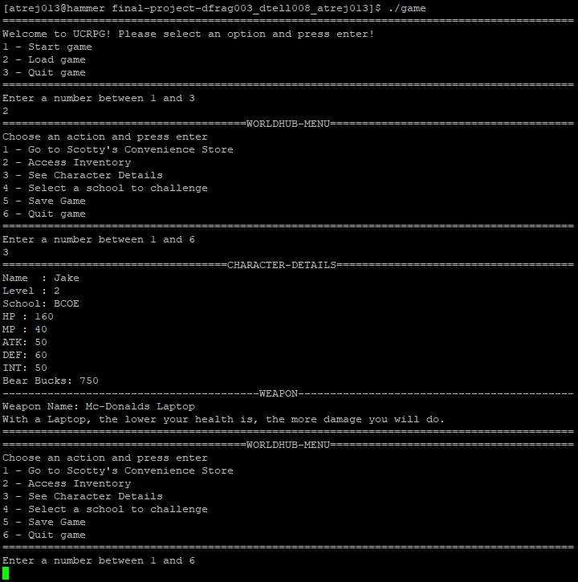

# UCRPG

 > Authors: [Dylan Fragante](https://github.com/sandy2304),
            [David Tellez](https://github.com/Davtellez01),
            [Alexander Trejo](https://github.com/trejotrejotrejo)
 
 ## Project Description
 * This is an RPG based on UCR campus and its different departments.
 * We think that this project would be fun and engaging to do. 
 ### Languages/tools/technologies
 * [C++] - to code the game.
 * [Image to ASCII converter](https://manytools.org/hacker-tools/convert-images-to-ascii-art/) - converts images into ASCII characters to implement into the code.
 ### Input/Output
 * Input: Different keys to interact with the game. Keyboard strings.
 * Output: Text from player's input. ASCII pictures based on different events.
 ### Design Patterns 
 #### Abstract Factory 
 * The abstract factory pattern will help with the creation of multiple entities that share the same traits but are specifically different to one another. This can be used to create different multiple types of enemies, areas, or classes. The different departments could have their own parent classes and we can make sub classes of that parent class to create multiple types of the same enemy, but with different statistics. This design pattern will solve the problem of creation of many classes with the same traits.
#### Strategy
* The strategy pattern will be useful with the creation of different attacks for the player and enemies. For example, we can create a context of attacks, and have different strategies of attacks like, slash, poison, fireball. Another context would be skills, and the different strategies with could be how player's or enemy's stats like attack power, defense, or skill points are affected. This strategy pattern will help reduce the burden of modifying a main class whenever we want to add another type of attack or skill. Instead of modifying a main class, we can just add more classes that have a common interface whenever we would want to add skills/attacks.

## Class Diagram
.png)
.png)
### Class Description
* There are 6 main parts to our class diagram; Entity Class, Weapon Class, Skill Class, Entity_Factory Class, The Client, and the Save.
#### Entity Class
* Entity class is an interface to 6 derived classes that correspond to 6 out of 7 schools of University of California Riverside: BCOE, CHASS, CNAS, GSE, SB, and SM.
* Entity objects are both used for player entity and enemy entities that the game is going to interact with.
* Entity class aggregates to Weapon and Skill class interfaces, so that every entity will have a weapon and skill(s) to use.
#### Weapon Class
* The Weapon Class is an interface to 6 derived classes for the six derived classes of Entity.
* Has two virtual methods; one that shows weapon details, and one that executes weapon passive in battle.
* Each derived Entity classes will have a unique Weapon with a unique passive skill that will be used in battles.
#### Skill Class: Strategy Pattern
* The Skill Class is an interface to 18 derived classes where each derived entity class(school) will have 3 Skills each.
* It has 2 virtual methods: do_Skill(), executes a skill implementaion; manaCheck(), checks if an Entity object has enough mana for a skill.
* The different skill abilities are basically the strategies and these can be set in the game client.
#### Entity_Factory: Abstract Factory
* The Entity_Factory is an interface to 6 derived classes, which are the factories for the 6 different Entities/Schools of UCR.
* The Entity_Factory uses the new operator to create Entity and Weapon object(storing the weapon inside the Entity) pointers to be then returned as an Entity pointer.
* Depending on the parameters, it can create Entities based on level, or entity type(Player or Enemy)
#### Game Client
* The Game Client is where the game occurs and it is connected with all the class interfaces(Weapon is indirectly).
#### Save File
* The save file contains functions that will be used by the game client to save the progress of the player in game.

 > ## Final deliverable
 > All group members will give a demo to the TA during lab time. The TA will check the demo and the project GitHub repository and ask a few questions to all the team members. 
 > Before the demo, you should do the following:
 > * Complete the sections below (i.e. Screenshots, Installation/Usage, Testing)
 > * Plan one more sprint (that you will not necessarily complete before the end of the quarter). Your In-progress and In-testing columns should be empty (you are not doing more work currently) but your TODO column should have a full sprint plan in it as you have done before. This should include any known bugs (there should be some) or new features you would like to add. These should appear as issues/cards on your Kanban board. 
 
 ## Screenshots
 ### Game Start
 * We started a new game, made a test dummy, and gave the dummy a class for the game. 
 
 ### Shop
 * Player chooses option 1 to see the items from the store to use for battle.
 
 ### Backpack
 * Player chooses option 2 to see what the contents inside the backpack are. 
 
 ### Player info
 * Player chooses option 3 to see their stats before the battle. 
 
 ### Battle Begin!
 * Player selects option 4 and begins battle by choosing which class of enemies to fight.
 
 ### Enemy!
 * Player chooses CNAS and begins a fight with one of the enemies.
 
 ### Damage dealt
 * Player is informed how much damage the attack did to the enemy, along with HP and MP stats.
 
 ### On to the next one!
 * Player defeats the first enemy and encounters a second enemy!  
 
 ### Boss Battle!
 * Player defeats second enemy and is faced against the boss of the CNAS class.  
 
 ### Done for the day!
 * Player beats the final boss! Player selects option 5 to save the progress, and quits game. 
 
 ### Back for more!
 * Player loads up game and inputs option 3 to ensure all stats from the previous gameplay are correct.
 
 ## Installation/Usage
 * Testing and running UCRPG was programmed through [PuTTY](https://putty.org) and the repository can be cloned for usage. 
 * To run the game after the repository is cloned, type in `cmake3 .`, then `make`, and finally `./game`. 
 ## Testing
 > How was your project tested/validated? If you used CI, you should have a "build passing" badge in this README.
 
